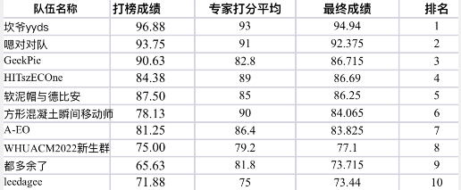

# EvenOdd

**[Massive Storage 第一届大学生信息存储技术竞赛 · 挑战赛](https://competition.huaweicloud.com/information/1000041751/introduction)参赛作品。**

## 赛题简介

存储系统保证容错的方式有两种，一种是多副本，即一份数据存储多份；另外一种方式是纠删码。纠删码和多副本相比，可以以更少的存储开销保证容错，因此，可以大大降低存储成本。在保证存储可靠性的同时，怎样在有限的资源下获得最好的编码，解码，和修复性能对存储系统来说十分重要。本次初赛赛题关注一个仅由异或操作便可以完成编解码的、最多可容两错的纠删码——EVENODD。本次赛题的目标是，在保证编解码正确性的基础上，在有限的系统资源下优化 EVENODD 各项操作的性能。具体的赛题说明请参照[附件](doc/evenodd_spec.docx)。

## 设计

请参考 [EvenOdd.pdf](doc/EvenOdd.pdf) 。

## 结果

在初赛和决赛均获冠军。
